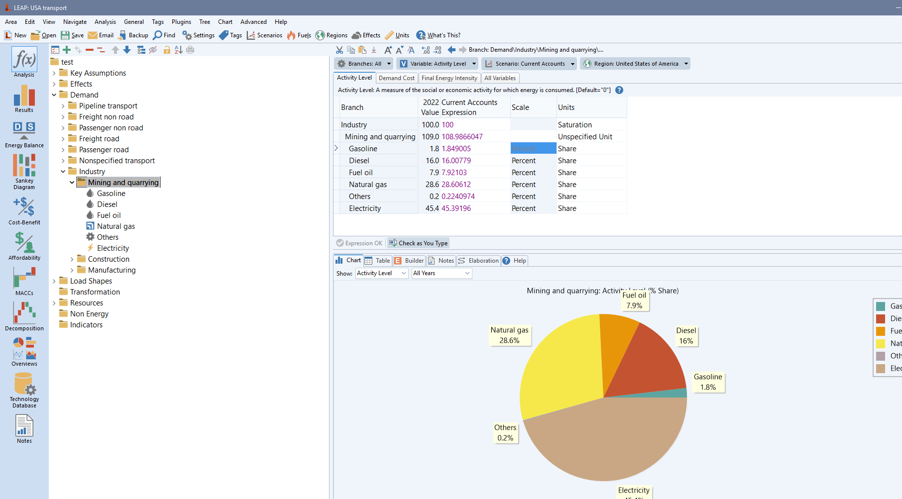
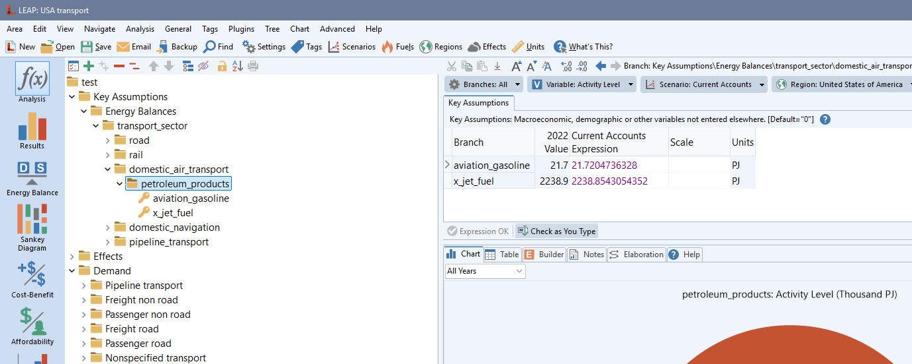

# leap-utilities

Shared LEAP helpers (COM connection, branch utilities, Excel import/export, energy-use reconciliation) extracted from the transport toolkit. Suitable for reuse across sectors. Talk to finn if you want help with the use of these.

## Setup

### 1) Conda env install

```bash
cd leap_utilities
conda env create -f environment.yml
conda activate leap_utilities
pip install -e .
```

## Using in another repo

```python
from codebase.functions.leap_core import connect_to_leap, build_expr
from codebase.functions.leap_excel_io import finalise_export_df
from codebase.functions.leap_exports import build_workbook_filename, build_and_save_workbook
from codebase.functions.leap_api import import_workbook, is_available
from codebase.functions.energy_use_reconciliation import build_branch_rules_from_mapping
```

These utilities were designed first for transport applications, so some functions accept transport-specific mappings but they are not required (e.g., vehicle types, modes).

## Modules

- `leap_core`: COM helpers, expression building, branch creation/fill utilities (transport mappings optional/injectable).
- `leap_excel_io`: helpers to build LEAP import Excel files and merge/view sheets.
- `leap_exports`: packaged helpers for export filename formatting, workbook creation, and workbook discovery/validation.
- `leap_api`: packaged helpers for LEAP API availability checks and workbook import operations.
- `energy_use_reconciliation`: ESTO/LEAP reconciliation helpers (transport checks optional).
- `power_workflow`: standalone power import workflow for `data/power export.xlsx` with scenario alignment, ESTO fuel validation, skip reporting, and hardcoded override hooks.

## Notes

- Requires Windows/pywin32 for COM access.
- If struggling talk to finn, he understands that it might be tricky!
- If you don't want to install, add the repo root to `PYTHONPATH`/`sys.path` before importing `code`, but `pip install -e .` is recommended.

# Industry example:

`codebase/industry_mapping_workflow.py` shows the minimal pattern for moving data between LEAP industry models using an Excel export/import mapping (the same format you get from LEAP’s `Analysis > Export to Excel Template`). You can generate that file in LEAP or build it yourself in the same shape (Branch Path, Variable, Scenario, Region, Scale, Units, Per..., years…).

### How to use the example:

- Open `codebase/industry_mapping_workflow.py` and point `leap_export_filename` to your mapping file (export from source model, or a custom file structured like a LEAP import/export sheet).
- Set `SCENARIO` and `REGION` to the target values in the destination LEAP area; adjust `sheet_name` if your Excel sheet differs from `"Export"`.
- If you need to create the branch structure in the destination model, set `CREATE_BRANCHES_FROM_EXPORT_FILE = True` (uses `create_branches_from_export_file`).
- To write the data into existing branches, keep `FILL_BRANCHES_FROM_EXPORT_FILE = True` (uses `fill_branches_from_export_file`) and optional `SET_UNITS=True` to carry over units from the sheet. > note the issue with setting scale values from the sheet that requires a manual fix within LEAP (see code comments).
- Run the script after making sure your Python environment is ready (e.g. pywin32 is installed) and LEAP is installed and open in the right area, region and scenario, with the right Fuels set. The helper will connect via `connect_to_leap()`, then create/fill branches based on your file.

### Notes/ideas:

- The same pattern works for other sectors—swap in a different export file or build one programmatically (see usage in the APERC `leap_transport` and `power_fish` repos).
- For percentage/share variables you may need to confirm the Scale in the LEAP GUI after import (e.g., set unit to “share” so LEAP assigns the correct scale).

Image below shows the end result of running the example script to copy data from the LEAP industry model (i.e. USA industry area) to the LEAP transport model (i.e. USA transport area), creating branches as needed and filling in data from the export file. It also shows how the scale and units are set correctly for the variables imported - after a manual fix for the scale issue mentioned above.



# Balance tables example:

This was a quick project to generate balance tables from the 9th edition energy dataset. See `codebase/balance_table_example.py` for an example of how to use the `copy_energy_spreadsheet_into_leap_import_file` module to build balance tables within LEAP for checking against the ESTO data while modelling. The script connects to LEAP, extracts energy use data, and generates branches and data within the assumptions folder for this.



# Power workflow:

Use `codebase/power_workflow.py` to prepare and import data from `data/power export.xlsx`.
The workflow:

- copies the source workbook to `outputs/leap_exports/power_export_prepared_{economy}_{scenario}.xlsx`,
- maps `Optimization` rows into `Reference` and `Target` scenarios while preserving `Current Accounts`,
- validates export fuel labels against cleaned ESTO products and writes `intermediate_data/power_fuel_validation_report.csv`,
- records skipped variables and fill/hardcoded outcomes in `intermediate_data/power_fill_audit_report.csv`,
- records hardcoded override application status in `intermediate_data/power_hardcoded_values_report.csv`.

# LEAP series comparison workflow:

Use `codebase/other/compare_leap_series.py` to compare LEAP output series against:

- ESTO base-year values (default `2022`), and
- allocated 9th projections (`2023+`) from `config/ninth_pairs_to_esto_pairs.xlsx`.

The workflow is mapping-driven. Start from:

- `config/leap_series_comparison_mapping_template.csv`

and define one row per comparison series (LEAP filters + ESTO flow/product target).

Example:

```bash
python3 codebase/other/compare_leap_series.py \
  --leap-file outputs/leap_exports/transformation_leap_imports_20_USA_Reference_Target_Current_Accounts.xlsx \
  --leap-sheet LEAP \
  --mapping-csv config/leap_series_comparison_mapping_template.csv \
  --economy 20_USA \
  --scenario Reference \
  --region "United States of America" \
  --output-dir outputs/series_comparison/usa_reference
```

Outputs:

- `comparison_long.csv`: one row per `series_id` + year.
- `comparison_wide.csv`: wide form with `leap_*`, `reference_*`, `delta_*` columns.
- `comparison_summary.csv`: per-series error metrics.
- `mapping_status.csv`: mapping match and reference-coverage diagnostics.
- `unmatched_leap_rows.csv`: LEAP rows not matched by any active mapping row.
- `charts/*.png`: per-series LEAP vs reference plots with delta subplot.

# Transport results-table comparison workflow:

Use `codebase/leap_series_analysis_workflow.py` for notebook-first usage (same style as other `_workflow.py` modules) where:

- sheets are identified from metadata in `A1:A4` (not sheet names),
- branch mappings are defined in `config/leap_transport_branch_to_ninth_sector_map.csv`,
- fuel-name normalization/overrides are defined in `config/leap_transport_fuel_aliases.csv`,
- references are `ESTO 2022 + 9th projections 2023+`.

Notebook example:

```python
from codebase.leap_series_analysis_workflow import run_with_config

# Edit constants at top of leap_series_analysis_workflow.py, then run:
artifacts = run_with_config()
```

Additional outputs for this workflow:

- `sheet_inventory.csv`: A1-A4 metadata scan and sheet-acceptance diagnostics.
- `fuel_mapping_status.csv`: resolved fuel-code/product mappings and unresolved cases.

CLI wrapper remains available at `codebase/other/compare_transport_results_tables.py` if needed.

# Common issues:

- Units need to be manually set within the LEAP GUI to ensure correct scale value if it is not already. This is because it seems that when we use the create_branches_from_export_file() funciton to create branches, they seem to default to some unknown value that seems to be making LEAP project incorrect values. See Industry example comments for more details.
